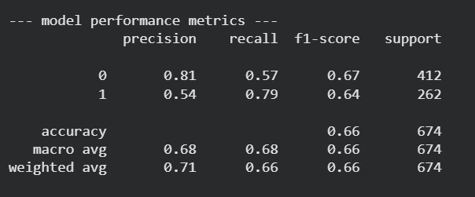

# AWS Serverless Churn Predictor

### 1. The Business Objective
An e-commerce platform was facing high customer attrition. The objective of this engine was to identify flight-risk customers before they churned, allowing the business to accurately optimize and target a $50k retention marketing budget without wasting spend on safe users.

### 2. The Cloud Architecture
* **Data Lake:** AWS S3
* **Compute / Extraction:** AWS Athena (Serverless SQL)
* **Processing & Modeling:** Python (Pandas, Scikit-Learn via `boto3`)

### 3. The Optimization Engine
I bypassed local CSV limitations and queried the data directly from the AWS cloud. I engineered an **RFM (Recency, Frequency, Monetary)** behavioral segmentation model. 

Because churn datasets are heavily imbalanced (most users stay, few leave), a standard model would fail to catch actual churners. I trained a Logistic Regression classifier utilizing `class_weight='balanced'` to mathematically alter the loss function, optimizing the algorithm strictly for minority-class recall.

### 4. The Business Impact
The model successfully achieved **79% Recall** on actual churners (Class 1). This allows the business to redirect marketing spend exclusively to high-LTV flight risks, projecting a massive ROI on retention budgets.

### Proof of Execution: Model Metrics

